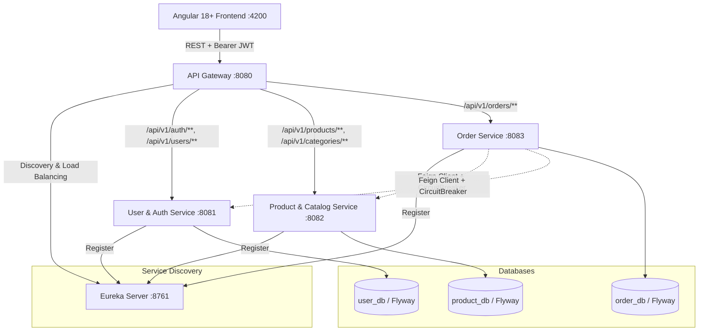

# ApexStore - Enterprise Microservices E-Commerce Platform

A production-style distributed microservices platform built with Spring Boot 3.3.x, Spring Cloud (Netflix Eureka, Spring Cloud Gateway, OpenFeign, Resilience4j), Spring Data JPA, Flyway, and an Angular 18+ standalone frontend.

---

## Architecture Overview



---

## Microservices Breakdown

| Service | Port | Database | Primary Responsibility |
|---------|------|----------|------------------------|
| **Eureka Server** | `8761` | None | Dynamic service registration, heartbeat, and discovery registry |
| **API Gateway** | `8080` | None | Single entry point, JWT validation, claims propagation, CORS |
| **User Service** | `8081` | `user_db` | User registration, login, BCrypt hashing, JWT issuance, profile management |
| **Product Service** | `8082` | `product_db` | Category and product catalog, stock inventory, stock reservation API |
| **Order Service** | `8083` | `order_db` | Order lifecycle, OpenFeign RPC, Resilience4j circuit breakers & fallbacks |
| **Frontend** | `4200` | LocalStorage | Angular 18+ Signals, Tailwind CSS, Cart, Checkout, Admin Console |

---

## Key Enterprise Architectural Patterns

1. **Service Discovery & Client-Side Load Balancing**:
   - Eureka server maintains active health registry.
   - Gateway and Feign use `lb://<service-name>` for declarative load balancing.

2. **API Gateway & Edge Security**:
   - JWT tokens validated at the edge.
   - Downstream services receive authenticated identity headers: `X-User-Id`, `X-User-Email`, `X-User-Roles`.

3. **Resilience4j Circuit Breaker & Graceful Degradation**:
   - Order placement RPC calls to `product-service` and `user-service` are wrapped with `@CircuitBreaker`.
   - In case of network partition or service downtime, graceful degradation handles failures cleanly without crashing caller threads.

4. **Database-per-Service Pattern**:
   - Strict database isolation across services (`user_db`, `product_db`, `order_db`).
   - Flyway automated migrations (`V1__init_*.sql`).
   - Dual-profile support: Zero-config in-memory/file H2 for rapid local development, and MySQL 8.0 for production/Docker.

5. **Uniform REST API Envelope**:
   - Standardized `ApiResponse<T>` envelope containing `success`, `message`, `data`, `timestamp`.
   - Global exception handling with `AppException` hierarchy.

---

## Getting Started

### Prerequisites
- Java 17 or 21 (LTS)
- Node.js 18+ and npm 10+
- Docker and Docker Compose (optional, for containerized deployment)

---

### Option 1: Local Development

#### 1. Compile All Backend Services
```powershell
.\mvnw.cmd clean package -DskipTests
```

#### 2. Start Services in Recommended Sequence
Open separate terminal windows and run each service:

```powershell
# 1. Start Eureka Registry (Port 8761)
cd eureka-server
..\mvnw.cmd spring-boot:run

# 2. Start User & Auth Service (Port 8081)
cd user-service
..\mvnw.cmd spring-boot:run

# 3. Start Product & Catalog Service (Port 8082)
cd product-service
..\mvnw.cmd spring-boot:run

# 4. Start Order Service (Port 8083)
cd order-service
..\mvnw.cmd spring-boot:run

# 5. Start API Gateway (Port 8080)
cd api-gateway
..\mvnw.cmd spring-boot:run
```

#### 3. Start Angular Frontend (Port 4200)
```powershell
cd frontend
npm start
```
Navigate to `http://localhost:4200` in your browser.

---

### Option 2: Docker Compose (Full Stack Orchestration)

To build and run the entire stack with containerized MySQL, Eureka, Gateway, and Services:

```bash
docker-compose up --build -d
```

Check running containers:
```bash
docker-compose ps
```

---

## Pre-Seeded Test Credentials

| Role | Email | Password | Access Rights |
|------|-------|----------|---------------|
| **Administrator** | `admin@example.com` | `Password@123` | Product CRUD, Order Status Management, System Topology |
| **Customer** | `customer@example.com` | `Password@123` | Catalog Browsing, Cart, Checkout, My Orders History |

---

## Swagger / OpenAPI Documentation

Each microservice provides interactive Swagger UI documentation for direct testing:
- **User Service:** `http://localhost:8081/swagger-ui.html`
- **Product Service:** `http://localhost:8082/swagger-ui.html`
- **Order Service:** `http://localhost:8083/swagger-ui.html`
- **Eureka Dashboard:** `http://localhost:8761`
