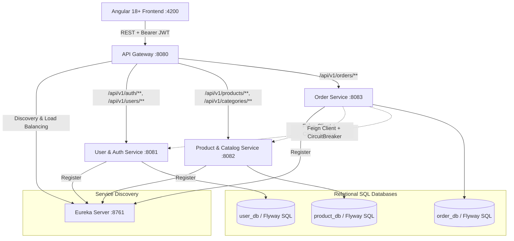

# ApexStore - Enterprise Microservices E-Commerce Platform

A production-style distributed microservices platform built with Spring Boot 3.3.x, Spring Cloud (Netflix Eureka, Spring Cloud Gateway, OpenFeign, Resilience4j), Spring Data JPA, Flyway SQL Migrations, and an Angular 18+ standalone frontend.

---

## Architecture Overview



---

## Microservices Breakdown

| Service | Port | Database | Primary Responsibility |
|---------|------|----------|------------------------|
| **Eureka Server** | `8761` | None | Dynamic service registration, heartbeat, and discovery registry |
| **API Gateway** | `8080` | None | Single entry point, JWT validation, claims propagation, CORS |
| **User Service** | `8081` | `user_db` (SQL) | User registration, login, BCrypt hashing, JWT issuance, seller onboarding |
| **Product Service** | `8082` | `product_db` (SQL) | Category & product catalog, multi-seller inventory, stock reservation API |
| **Order Service** | `8083` | `order_db` (SQL) | Multi-seller sub-order decomposition, Saga compensation, CircuitBreakers |
| **Frontend** | `4200` | LocalStorage | Angular 18+ Signals, Cart, Multi-Seller Checkout, Seller & Admin Dashboards |

---

## Relational SQL Database Architecture

All services strictly follow the **Database-per-Service** pattern using SQL schemas and Flyway migrations:

1. **User Database (`user_db`)**:
   - `users`: User profiles, roles, authentication credentials
   - `seller_profiles`: Multi-seller business details, verification status, store metadata
2. **Product Database (`product_db`)**:
   - `categories`: Hierarchy, category slugs, descriptions
   - `products`: Multi-seller catalog, SKU tracking, pricing, inventory stock
3. **Order Database (`order_db`)**:
   - `parent_orders`: Customer unified checkout records, aggregated totals
   - `sub_orders`: Seller-specific decomposed order fulfillments
   - `sub_order_items`: Line items mapped to each store

### SQL Migration Files:
- [`user-service/src/main/resources/db/migration/`](file:///d:/MicroService/user-service/src/main/resources/db/migration)
- [`product-service/src/main/resources/db/migration/`](file:///d:/MicroService/product-service/src/main/resources/db/migration)
- [`order-service/src/main/resources/db/migration/`](file:///d:/MicroService/order-service/src/main/resources/db/migration)

---

## Getting Started

### Prerequisites
- Java 17 or 21 (LTS)
- Node.js 18+ and npm 10+
- Optional: Local MySQL Server (port 3306) or use the zero-configuration embedded SQL mode.

---

### One-Click Startup (Recommended)

From the project root `d:\MicroService`:

```powershell
.\start-all.ps1
```
*(or double-click `start-all.bat`)*

This automatically starts:
1. Eureka Server (`8761`)
2. User Service (`8081`)
3. Product Service (`8082`)
4. Order Service (`8083`)
5. API Gateway (`8080`)
6. Angular Frontend (`4200`)

---

### Management Scripts

| Command | Action |
|---------|--------|
| `.\start-all.ps1` | Launch all microservices and frontend |
| `.\start-all.ps1 -SkipFrontend` | Launch backend services only |
| `.\status.ps1` | Inspect live ports and process IDs |
| `.\stop-all.ps1` | Stop and kill all running services cleanly |

---

## Pre-Seeded Test Credentials

| Role | Email | Password | Access Rights |
|------|-------|----------|---------------|
| **Administrator** | `admin@example.com` | `Password@123` | Product moderation, seller approvals, system management |
| **Seller 1** | `seller1@example.com` | `Password@123` | Apex Electronics store management, product inventory |
| **Seller 2** | `seller2@example.com` | `Password@123` | Nordic Home store management, sub-order fulfillment |
| **Customer** | `customer@example.com` | `Password@123` | Multi-seller cart, checkout, order tracking |

---

## Swagger / OpenAPI Documentation

- **User Service:** [http://localhost:8081/swagger-ui.html](http://localhost:8081/swagger-ui.html)
- **Product Service:** [http://localhost:8082/swagger-ui.html](http://localhost:8082/swagger-ui.html)
- **Order Service:** [http://localhost:8083/swagger-ui.html](http://localhost:8083/swagger-ui.html)
- **Eureka Dashboard:** [http://localhost:8761](http://localhost:8761)
- **Frontend App:** [http://localhost:4200](http://localhost:4200)
